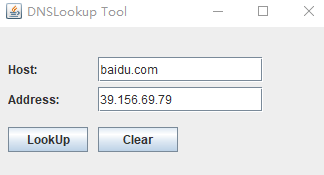

# DNSLookupTool
The simple DNS Lookup Tool in Java

**1. DNSLookup**

You can `javac DNSLookup.java` or download a pre-compiled version `DNSLookup.class`.

```
$ javac DNSLookup.java

$ java DNSLookup
The host: DESKTOP-UL0GUON has address: 192.168.80.1

$ java DNSLookup  baidu.com
The host: baidu.com has address: 39.156.69.79
```


**2. DNSLookupIO**

```
$ javac DNSLookupIO.java

$ java DNSLookupIO
Please enter the host:
baidu.com
The host: baidu.com has address: 39.156.69.79
```


**3. DNSLookGui**

```
// Use of this command was unsuccessful
$ jar cvf DNSLookupGui.jar DNSLookupGui.class

// Use of eclipse export jar file can be successful
// Use command or click on DNSLookupGui.jar
$ java -jar DNSLookupGui.jar
```

GUI Running Results:



